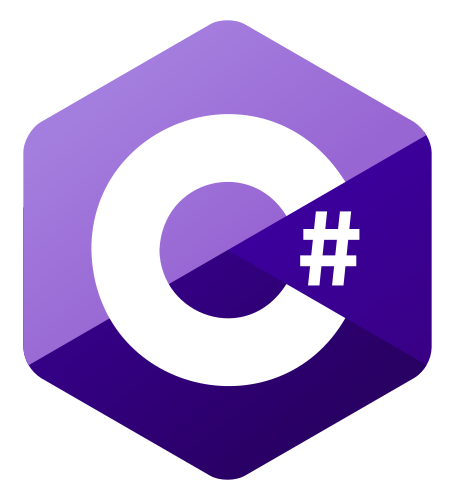

# C# Introduction 

Introduction to c#

 (***image from wikipedia***)

### Based on the following inter alia udemy courses:

#### C# Basics for Beginners: Learn C# Fundamentals by Coding
https://www.udemy.com/course/csharp-tutorial-for-beginners/

#### C# Intermediate: Classes, Interfaces and OOP
https://www.udemy.com/course/csharp-intermediate-classes-interfaces-and-oop/

#### C# Advanced Topics: Prepare for Technical Interviews
https://www.udemy.com/course/csharp-advanced/